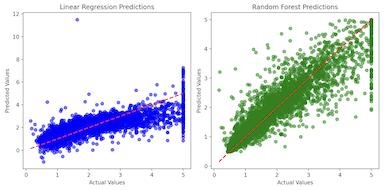

# Build a Simple Regression Model in Python
A Python script to build and evaluate a simple regression model using **California Housing dataset**. This script compares `LinearRegression` and `RandomForestRegressor` models.



## Usage
Run the script to train and evaluate the models:
```sh
python simple_regression.py
```

Example Output:
```sh
--- Model Performance Comparison ---
Linear Regression:
  - MSE: 0.56
  - R² Score: 0.61
Random Forest Regression:
  - MSE: 0.25
  - R² Score: 0.82
```

## Concept
[Visit (takehika0129.github.io)](https://takehika0129.github.io/takehika-github-pages/reviews/prototype7.html)

## Requirements
- Python 3.x
- `numpy`
- `pandas`
- `sklearn`
- `matplotlib`

Install dependencies:
```sh
pip install -r requirements.txt
```

## License
You are free to use this code for personal and educational purposes. Commercial use and redistribution are not allowed.